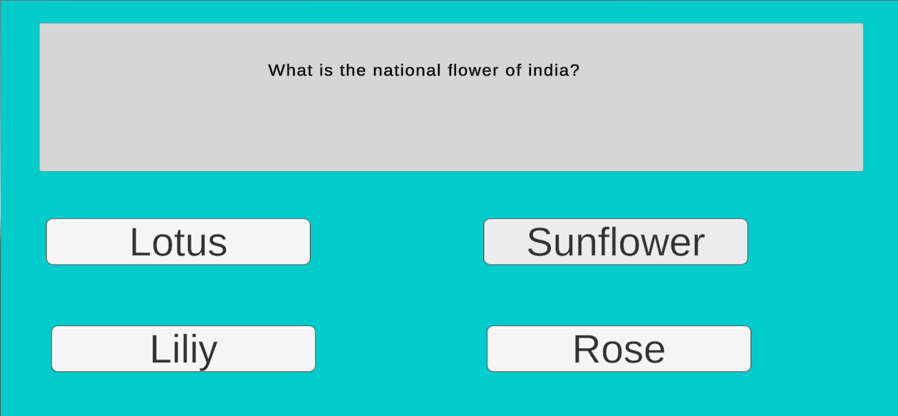
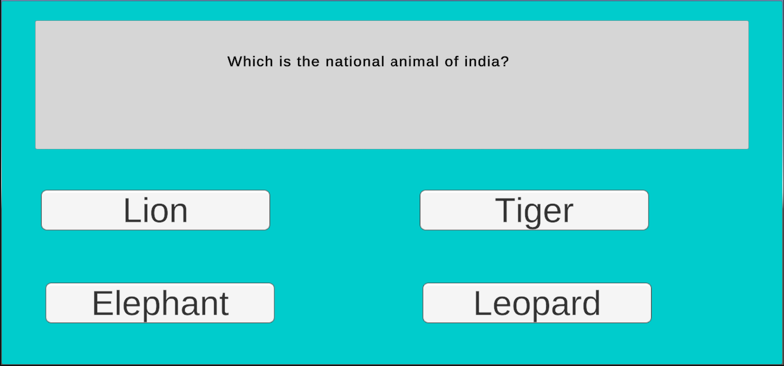

# Quiz Game

## Description
This Unity-based quiz game allows players to test their knowledge by selecting one option out of four for each question. After choosing an option, players will receive instant feedback indicating whether their choice was correct or not in the console. This quiz game provides an enjoyable way to learn and have fun.

## Features
- Multiple-choice questions: Each question presents players with four options to choose from.
- Instant feedback: Players receive immediate feedback after selecting an option, informing them whether their choice was correct or incorrect.
- Engaging gameplay: With a variety of questions covering different topics, players can enjoy an immersive learning experience.

## How to Play
1. Clone the repository into your local device.
2. Open the project in your Unity GameEngine.
3. Read the question carefully and choose one option out of the four provided.
4. After selecting an option, wait for instant feedback to see if your choice was correct.
5. Continue answering questions until you complete the quiz.

## Controls
- Mouse: Click to select an option.

## Screenshots

## Contributing

Feel free to contribute to the project by opening issues or creating pull requests. Follow the guidelines outlined in [CONTRIBUTING.md].

## License

This project is licensed under the [MIT License] - see the [LICENSE.md] file for details.

